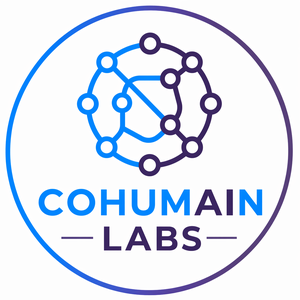
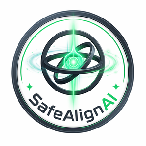
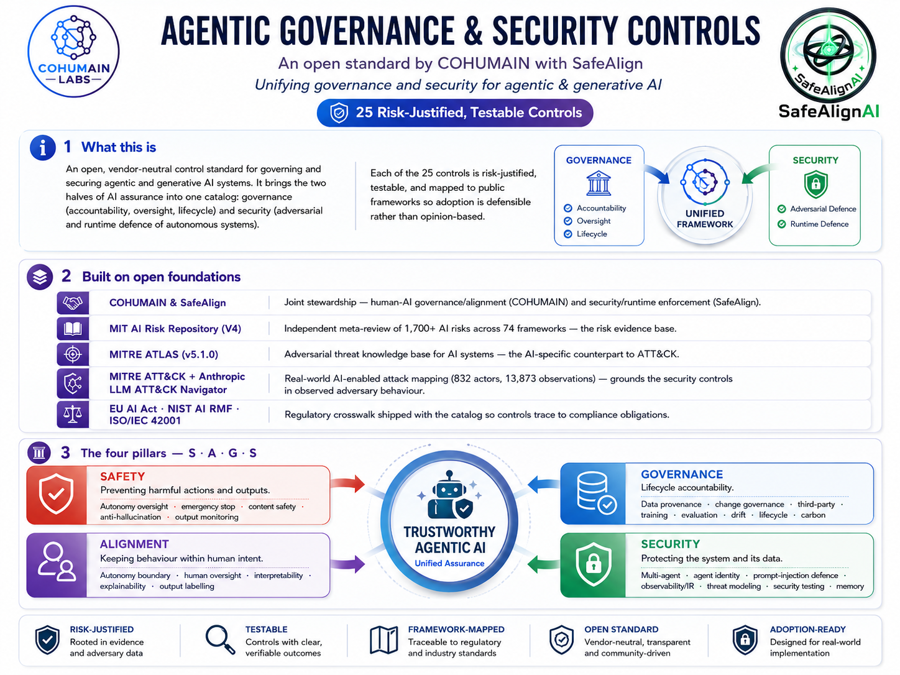

<div align="center">

 &nbsp;&nbsp; 

# Agentic Governance &amp; Security Controls
### by COHUMAIN Labs &amp; SafeAlign AI

**An open standard that unifies _governance_ and _security_ for agentic &amp; generative AI.**

[](https://himjoe.github.io/Agentic-governance-and-security-controls-by-COHUMAIN-Labs-and-Safealign-AI/)
[](./LICENSE)
[](./controls/CONTROLS.md)
[](#-the-four-pillars--sags)
[](#-mapped-to-the-frameworks-that-matter)

[**🌐 Website**](https://himjoe.github.io/Agentic-governance-and-security-controls-by-COHUMAIN-Labs-and-Safealign-AI/) | [**📖 Full control catalog**](./controls/CONTROLS.md) | [**🤝 Contributing**](./CONTRIBUTING.md)

</div>

---

## Overview



## TL;DR

For a traditional system, **governance** (is it accountable, documented, overseen?) and **security** (is it protected from attackers?) are separate disciplines run by separate teams. For an **autonomous agent**, they collapse into one operational problem: **can this system act safely, lawfully, and securely while it is making decisions and taking actions on its own?**

This repository is an **open, vendor-neutral control standard** that answers both at once: **25 controls** across **four pillars** (Safety | Alignment | Governance | Security), each risk-justified, evidence-based, and mapped to the frameworks enterprises already use.

> Built by [**COHUMAIN Labs**](https://www.cohumain.ai/research) (responsible-AI research) and [**SafeAlign AI**](https://safealignai.io/) (govern, monitor &amp; secure AI agents at enterprise scale).

---

## Why this exists, three things that are genuinely new

| | What changes with agentic AI |
|---|---|
| **1, The failure mode inverts** | Traditional IT fails by *stopping*. An agent fails by *continuing*, fully operational, acting wrongly, at machine speed, across systems before a human reacts. This creates a safety and governance issue, not merely a cybersecurity issue. |
| **2, The model is the attack surface** | Prompt injection is an attack written in plain language *inside data*, invisible to code scanning. The agent's own reasoning becomes the exploit path. |
| **3, Orchestration is the risk, not skill** | Across **832 real-world malicious actors** (Anthropic, 2026), the highest-risk operations were distinguished **not** by technical sophistication or tool novelty, but by **autonomous, persistent, multi-step orchestration**. |

That third finding is why this standard puts dedicated **autonomy, multi-agent, and threat-modeling controls** at its core, see [the ATT&amp;CK mapping](#-defending-against-the-weaponised-agent).

---

## 🧭 The four pillars, S|A|G|S

| Pillar | Purpose | Controls |
|--------|---------|----------|
| 🛡️ **Safety** | Prevent harmful actions and outputs | 5, oversight, kill-switch, content safety, anti-hallucination, output monitoring |
| 🎯 **Alignment** | Keep behaviour within human intent | 5, autonomy boundary, human oversight, interpretability, explainability, labelling |
| ⚖️ **Governance** | Lifecycle accountability | 8, provenance, change, third-party, training, evaluation, drift, lifecycle, carbon |
| 🔒 **Security** | Protect the system and its data | 7, multi-agent, identity, injection defence, observability, threat modeling, testing, memory |

**8 of the 25 controls are _AI-native_**, they have no analog in traditional IT or security and must be built new. The other 17 _adapt_ established practice for the agentic context.

---

## 📋 The 25 controls at a glance

| ID | Pillar | Control | Type | Tier | Closes (MIT risk) |
|----|--------|---------|------|------|-------------------|
| `SAF-01` | 🛡️ Safety | Autonomous System Oversight | AI-Native | T1 | 7.1 AI pursuing its own goals in conflict with human goals/values |
| `SAF-02` | 🛡️ Safety | Emergency Stop & Containment (Kill Switch) | Adapted | T1 | 7.1 AI pursuing its own goals in conflict with human goals/values |
| `SAF-03` | 🛡️ Safety | Content Safety & Misuse Prevention | AI-Native | T1 | 1.2 Exposure to toxic content |
| `SAF-04` | 🛡️ Safety | Output Factual Accuracy & Anti-Hallucination | AI-Native | T2 | 3.1 False or misleading information |
| `SAF-05` | 🛡️ Safety | AI Output Monitoring & Safeguards | AI-Native | T2 | 3.1 False or misleading information |
| `ALN-01` | 🎯 Alignment | Autonomy Boundary Control | AI-Native | T1 | 7.1 AI pursuing its own goals in conflict with human goals/values |
| `ALN-02` | 🎯 Alignment | Human Oversight & Intervention | Adapted | T1 | 5.2 Loss of human agency and autonomy |
| `ALN-03` | 🎯 Alignment | Decision Interpretability | Adapted | T3 | 7.4 Lack of transparency or interpretability |
| `ALN-04` | 🎯 Alignment | Model Explainability | Adapted | T3 | 7.4 Lack of transparency or interpretability |
| `ALN-05` | 🎯 Alignment | Output Labeling & Action Attribution | Adapted | T2 | 3.1 False or misleading information |
| `GOV-01` | ⚖️ Governance | Data Provenance & Input Integrity | Adapted | T2 | 2.2 AI system security vulnerabilities and attacks |
| `GOV-02` | ⚖️ Governance | AI Change Governance | Adapted | T2 | 7.3 Lack of capability or robustness |
| `GOV-03` | ⚖️ Governance | Third-Party & Supply-Chain Oversight | Adapted | T3 | 6.5 Governance failure |
| `GOV-04` | ⚖️ Governance | Model Training Governance | Adapted | T3 | 1.1 Unfair discrimination and misrepresentation |
| `GOV-05` | ⚖️ Governance | Model Evaluation | Adapted | T2 | 7.3 Lack of capability or robustness |
| `GOV-06` | ⚖️ Governance | Model Continuous Improvement & Drift Management | Adapted | T3 | 7.3 Lack of capability or robustness |
| `GOV-07` | ⚖️ Governance | AI Lifecycle & Registry Management | Adapted | T3 | 7.3 Lack of capability or robustness |
| `GOV-08` | ⚖️ Governance | Environmental & Carbon Governance | Adapted | T3 | 6.6 Environmental harm |
| `SEC-01` | 🔒 Security | Multi-Agent Coordination Security | AI-Native | T2 | 7.6 Multi-agent risks |
| `SEC-02` | 🔒 Security | Agent Identity & Least-Privilege Authorization | Adapted | T1 | 2.2 AI system security vulnerabilities and attacks |
| `SEC-03` | 🔒 Security | Prompt Injection & Adversarial Input Defense | AI-Native | T1 | 2.2 AI system security vulnerabilities and attacks |
| `SEC-04` | 🔒 Security | Observability, Anomaly Detection & Incident Response | Adapted | T1 | 2.2 AI system security vulnerabilities and attacks |
| `SEC-05` | 🔒 Security | AI Threat Modeling | Adapted | T2 | 2.2 AI system security vulnerabilities and attacks |
| `SEC-06` | 🔒 Security | AI Security Testing & Red-Teaming | Adapted | T2 | 2.2 AI system security vulnerabilities and attacks |
| `SEC-07` | 🔒 Security | Memory & Context Lifecycle Security | AI-Native | T2 | 2.1 Compromise of privacy (leaking / inferring sensitive info) |

➡️ **Full specifications** (key requirements, evidence, risk examples, cadence, complete mappings): **[`controls/CONTROLS.md`](./controls/CONTROLS.md)**
➡️ **Machine-readable:** [`controls/controls.json`](./controls/controls.json) | [`controls/controls.csv`](./controls/controls.csv)

---

## 🎯 Defending against the weaponised agent

Each security control is mapped to the **real-world MITRE ATT&amp;CK techniques a hijacked agent would actually execute**, drawn from Anthropic's analysis of AI-enabled cyber operations (832 actors / 166 techniques) and extended for the missing category of agentic orchestration.

| ATT&amp;CK technique | Observed in | Countered by |
|---|---|---|
| `T1587` Develop Capabilities | ~69% of actors | `SAF-03` Content Safety |
| `T1078` / `T1003` Valid Accounts / Credential Dumping | top high-risk markers | `SEC-02` Agent Identity &amp; Least-Privilege |
| `T1190` / `T1566` Initial access (injection analog) | entry vector | `SEC-03` Prompt Injection Defence |
| `T1562` / `T1021` / `T1020` Evasion, lateral movement, exfil | killchain | `SEC-04` Observability &amp; IR |
| **Agentic Orchestration** | **highest-risk operations** | `SEC-01`, `SAF-01`, `SEC-05` |

> **The key insight:** autonomous, multi-step, AI-directed killchain orchestration **has no MITRE ATT&amp;CK ID yet.** That taxonomy gap is precisely the agentic risk this standard governs. Full mapping: [`frameworks/mitre-attack.md`](./frameworks/mitre-attack.md)

---

## 🪜 Conformance tiers

A graduated, cumulative adoption path, declare the tier you conform to.

| Tier | Scope | For |
|------|-------|-----|
| **Tier 1, Foundational** | 8 controls, the minimum production bar | Any production agent |
| **Tier 2, Managed** | 18 cumulative, adds governance + proactive security | Material or customer-facing systems |
| **Tier 3, Assured** | 25 total, continuous conformance + attestation | EU AI Act high-risk readiness |

Details: [`docs/conformance.md`](./docs/conformance.md).

---

## 🗺️ Mapped to the frameworks that matter

Every control traces to externally-catalogued risk and recognised compliance obligations, so adoption is **defensible, not opinion-based.**

| Framework | Role | Crosswalk |
|---|---|---|
| [**MIT AI Risk Repository**](https://airisk.mit.edu/) | The risk each control closes (7 domains / 24 subdomains) | [`frameworks/mit-ai-risk.md`](./frameworks/mit-ai-risk.md) |
| [**MITRE ATLAS**](https://atlas.mitre.org/) | Adversarial-ML technique per control | [`frameworks/mitre-atlas.md`](./frameworks/mitre-atlas.md) |
| [**MITRE ATT&amp;CK** + Anthropic Navigator](https://red.anthropic.com/2026/attack-navigator/) | What a weaponised agent would do | [`frameworks/mitre-attack.md`](./frameworks/mitre-attack.md) |
| **EU AI Act, NIST AI RMF, ISO/IEC 42001** | Compliance obligation per control | [`frameworks/regulatory-crosswalk.md`](./frameworks/regulatory-crosswalk.md) |

---

## 📂 Repository structure

```
.
├── README.md                                  ← you are here
├── LICENSE                                     ← CC BY 4.0
├── CONTRIBUTING.md | GOVERNANCE.md | CHANGELOG.md | CITATION.cff
├── controls/
│   ├── CONTROLS.md        ← full human-readable catalog
│   ├── controls.json      ← machine-readable (full detail)
│   └── controls.csv       ← machine-readable (flat)
├── frameworks/
│   ├── mit-ai-risk.md | mitre-atlas.md | mitre-attack.md | regulatory-crosswalk.md
├── docs/                  ← GitHub Pages website (the-standard, pillars, conformance, methodology)
│   └── index.html
└── .github/               ← issue templates, PR template, Pages workflow
```

---

## 🚀 How to use this standard

1. **Assess.** Take the [control catalog](./controls/CONTROLS.md) and mark each control as *Met / Partial / Gap* for your agent system.
2. **Pick a tier.** Choose Foundational, Managed, or Assured based on the system's risk and exposure.
3. **Evidence it.** For each in-scope control, collect the named evidence in its spec, that's what makes conformance auditable rather than assertional.
4. **Map to your stack.** The mappings tell you which regulatory obligation (EU AI Act article, NIST function, ISO clause) each control satisfies.
5. **Enforce at runtime.** The controls are platform-agnostic; pair them with a runtime enforcement layer (e.g. SafeAlign AI's monitoring, kill-switch and oversight tooling) to make them live.

The machine-readable [`controls.json`](./controls/controls.json) is designed to be imported directly into GRC tooling, policy engines, or your own conformance tracker.

---

## 🔬 Research foundations

This standard operationalises peer-reviewed research from **COHUMAIN Labs**:

- **Meta-Governance of Multi-Agent Systems toward Robust Safety, Alignment, Governance &amp; Security**, *ICLR 2026, Agents in the Wild* | [PDF](https://www.cohumain.ai/uploads/research/e5r9s.pdf)
- **Governance- and Security-by-Design: Embedding Safety and Alignment into Agentic AI Systems**, *IASEAI 2026, Paris* | [repo](https://github.com/HimJoe/Governance--and-Security-by-Design-Embedding-Safety-and-Alignment-into-Agentic-AI-Systems)
- **AI Governance by Design for Agentic Systems**, [preprint](https://www.preprints.org/manuscript/202504.1707)
- **Joint Evaluation (Jo.E): Human + LLM + Multi-Agent Collaboration for AI Safety &amp; Alignment**, [preprint](https://www.preprints.org/manuscript/202509.0042)
- **Transparent AI: The Case for Interpretability and Explainability**, [arXiv](https://arxiv.org/abs/2507.23535)

Full index → [cohumain.ai/research](https://www.cohumain.ai/research)

---

## 🤝 Contributing

This is an open standard, it improves through use. We welcome practitioners building agent systems, security engineers who red-team them, and governance leads applying it in regulated settings. See **[`CONTRIBUTING.md`](./CONTRIBUTING.md)** for how to propose additions, clarifications, and field feedback.

---

## 📜 License &amp; attribution

The standard, mappings, and documentation are released under **[CC BY 4.0](./LICENSE)**, free to adopt and adapt with attribution.

Framework attributions are retained to their owners: the **MIT AI Risk Repository** (CC BY, MIT), **MITRE ATLAS** &amp; **ATT&amp;CK** (© The MITRE Corporation), and the **LLM ATT&amp;CK Navigator** (Anthropic, 2026).

<div align="center">

---

**For further details and collaboration, contact [info@cohumain.ai](mailto:info@cohumain.ai).**

**Let's build responsible AI, together.**

[COHUMAIN Labs](https://www.cohumain.ai/) | [SafeAlign AI](https://safealignai.io/) | [Research](https://www.cohumain.ai/research) | [Website](https://himjoe.github.io/Agentic-governance-and-security-controls-by-COHUMAIN-Labs-and-Safealign-AI/)

</div>
